  <picture>
    <source media="(prefers-color-scheme: dark)"  srcset="./dark.svg">
    <source media="(prefers-color-scheme: light)" srcset="./light.svg">
    
  </picture>

  
  
  
  
  
  
  
  
  
  
  
  
  
  
  

